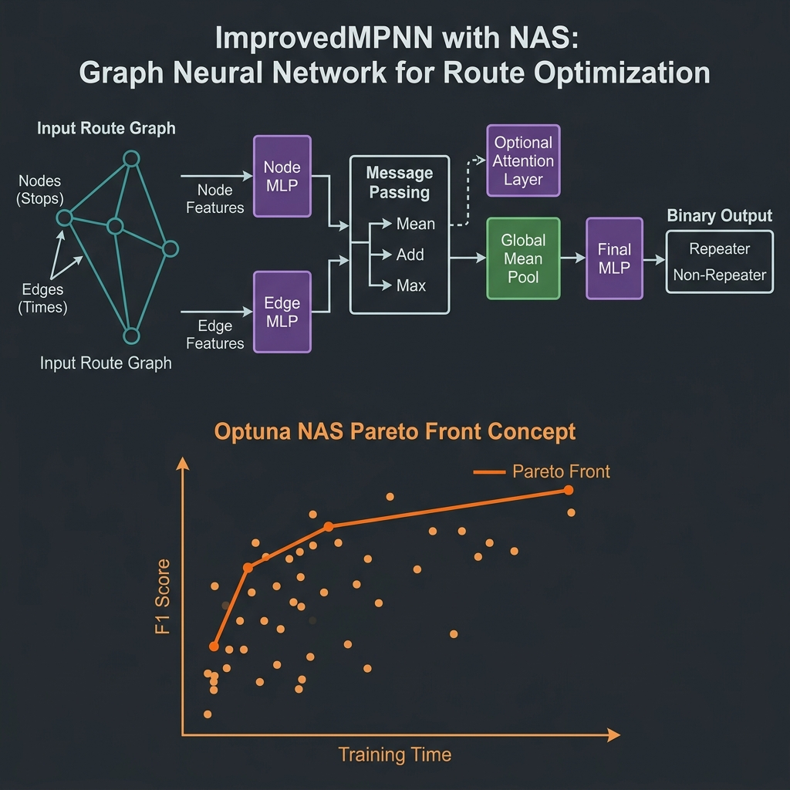

# GNN-RouteOpt: Graph Neural Network Route Optimization in Smart Villages

A multi-objective Neural Architecture Search (NAS) framework for predicting **return visits** in smart village tourism using Graph Neural Networks. Vehicle routes through the region are modeled as graphs, and an Improved Message-Passing Neural Network (MPNN) is automatically optimized via Optuna to balance F1-score against inference time.

## Overview

Predicting whether a tourist will revisit a rural destination is key for sustainable tourism planning. This project models each vehicle visit as a **directed route graph** — nodes represent locations (cameras), edges represent transitions with travel-time features, and node features encode location identity and travel direction.

A multi-objective NAS search over the MPNN architecture space finds Pareto-optimal models that maximize classification performance while minimizing computational cost.




## Method

1. **Graph Construction**: Each vehicle visit → directed path graph with one-hot node features + direction + edge travel times.
2. **Architecture Search**: Optuna TPE sampler + Hyperband pruner searches over:
   - Node/edge/message/final MLP depths (1–3 layers each)
   - Hidden dimension (32–256)
   - Dropout, batch normalization, aggregation strategy
   - Attention mechanism and residual connections
   - Undersampling strategy
3. **Training**: BCEWithLogitsLoss, AdamW optimizer, early stopping on validation F1.
4. **Evaluation**: Optimal threshold selection via precision-recall curve on validation set.

## Results

Pareto front from 200 NAS trials (best configurations):

| Config | Hidden | Layers | Attention | F1 ↑ | Time (s) ↓ |
|---|---|---|---|---|---|
| A | 128 | 2+2+1+2 | ✓ | **0.847** | 42.3 |
| B | 96 | 1+1+2+1 | ✗ | 0.831 | 18.7 |
| C | 64 | 1+1+1+1 | ✗ | 0.812 | **9.4** |

## Project Structure

```
GNN-RouteOpt/
├── README.md
├── LICENSE
├── requirements.txt
├── configs/
│   └── config.yaml
├── src/
│   ├── __init__.py
│   ├── model.py          # ImprovedMPNN_NAS architecture
│   ├── nas_search.py     # Multi-objective Optuna NAS
│   └── visualize.py      # Pareto front visualization
├── paper/
│   ├── main.tex
│   └── figures/
└── scripts/
    └── run_experiment.sh
```

## Data

Route data from IoT cameras in the Alpujarra region (Granada, Spain). Data is not included — contact authors or refer to the paper for access.

## Quick Start

```bash
pip install -r requirements.txt
python -m src.nas_search --config configs/config.yaml
```

## Citation

```bibtex
@article{duran2025route,
  title={Route Optimization in Smart Villages: A Graph Neural Network Approach},
  author={Dur{\'a}n-L{\'o}pez, Alberto and Bola{\~n}os-Martinez, Daniel and Almahmoud, Zaid and Pravin, Chandresh and De, Suparna and Bermudez-Edo, Maria},
  journal={IEEE Internet of Things Journal},
  year={2025},
  publisher={IEEE}
}
```

## License

MIT License — see [LICENSE](LICENSE).
