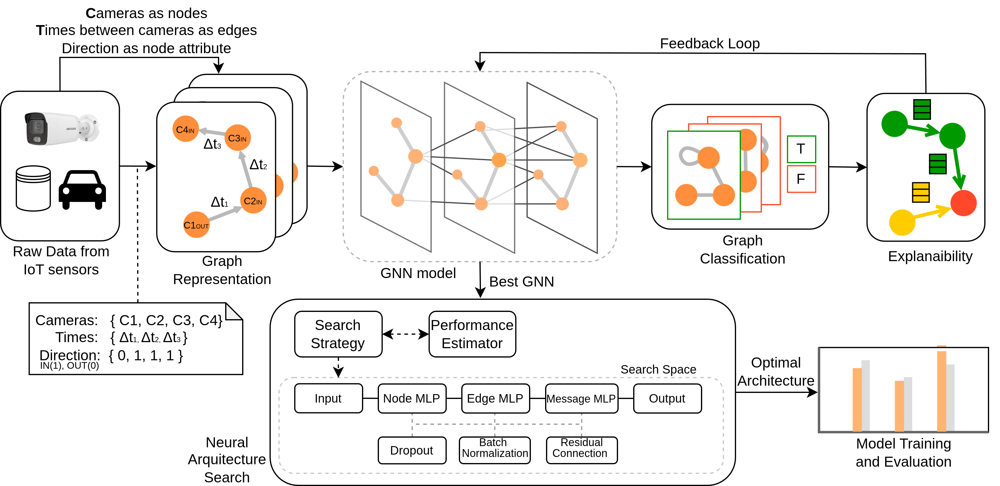
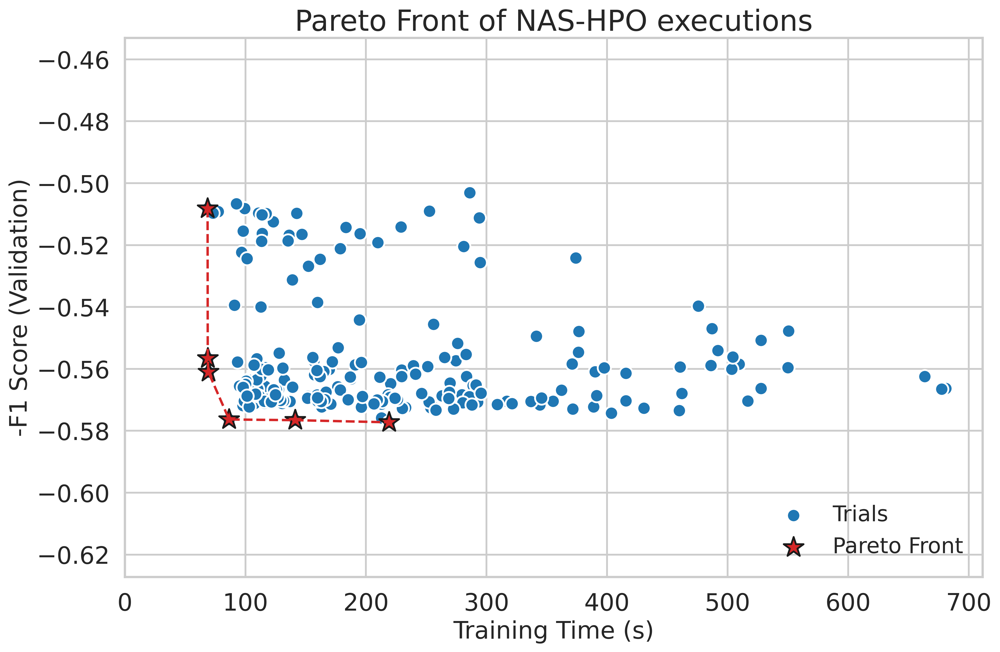

# GNN-RouteOpt: GNN-based Route Optimization in Smart Villages

A multi-objective Neural Architecture Search (NAS) framework for predicting **return visits** in smart village tourism using Graph Neural Networks (GNNs). Vehicle routes through a region are modeled as graphs, and an optimal architecture (E-GAT + NAS-HPO) is automatically searched via Optuna to balance F1-score against execution time.

<p align="center">
  
</p>
<p align="center">
  <em>Figure 1: Pipeline and architecture of the GNN-RouteOpt framework with multi-objective NAS.</em>
</p>

---

## Method Overview

### Graph Modeling
Each vehicle journey is modeled as a directed path graph $G = (V, E, X_v, X_e)$, where:
- $V$ is the set of camera nodes visited by a vehicle.
- $E$ is the set of directed transitions.
- $X_v \in \mathbb{R}^{|V| \times (N+1)}$ represents the node features containing a one-hot representation of the camera ID and the travel direction.
- $X_e \in \mathbb{R}^{|E| \times 1}$ is the edge feature containing the travel time.

### E-GAT Attention & Updates
The Edge-featured Graph Attention Network (E-GAT) computes attention coefficients $\alpha_{uv}$ over both node and edge representations:

$$\alpha_{uv} = \frac{\exp\left(\text{LeakyReLU}\left(\mathbf{a}^T [W_n h_u^{(l-1)} \mathbin{\Vert} W_n h_v^{(l-1)} \mathbin{\Vert} W_e x_{e_{uv}}^{(l-1)}]\right)\right)}{\sum_{k \in \mathcal{N}(v)} \exp\left(\text{LeakyReLU}\left(\mathbf{a}^T [W_n h_k^{(l-1)} \mathbin{\Vert} W_n h_v^{(l-1)} \mathbin{\Vert} W_e x_{e_{kv}}^{(l-1)}]\right)\right)}$$

The node embeddings $h_v^{(l)}$ and edge embeddings $x_{e_{uv}}^{(l)}$ at layer $l$ are iteratively updated as follows:

$$h_v^{(l)} = \text{Activation}\left(W_{\text{node}} \left[ h_v^{(l-1)} \mathbin{\Vert} \text{AGG}_{u \in \mathcal{N}(v)} \left( \alpha_{uv} \cdot \left( W_u h_u^{(l-1)} + W_e x_{e_{uv}}^{(l-1)} \right) \right) \right]\right)$$

$$x_{e_{uv}}^{(l)} = \text{Activation}\left(W_{\text{edge}} \left[ h_u^{(l-1)} \mathbin{\Vert} h_v^{(l-1)} \mathbin{\Vert} x_{e_{uv}}^{(l-1)} \right]\right)$$

---

## Experimental Results

### Table I: Comparison of All 10 GNN Models (Weighted Average)

| Model | Class | Precision | Recall | F1-score | Weighted Precision | Weighted Recall | Weighted F1-score |
| :--- | :--- | :---: | :---: | :---: | :---: | :---: | :---: |
| **GCN** | Non-Repeater <br> Repeater | 0.77 <br> 0.37 | 0.23 <br> 0.87 | 0.35 <br> 0.52 | 0.63 | 0.45 | 0.41 |
| **E-GCN** | Non-Repeater <br> Repeater | 0.78 <br> 0.53 | 0.74 <br> 0.59 | 0.76 <br> **0.56** | 0.69 | 0.69 | 0.69 |
| **GraphSAGE** | Non-Repeater <br> Repeater | 0.71 <br> 0.50 | 0.83 <br> 0.34 | 0.76 <br> 0.40 | 0.64 | 0.66 | 0.64 |
| **E-GraphSAGE** | Non-Repeater <br> Repeater | 0.77 <br> 0.61 | 0.78 <br> 0.52 | 0.77 <br> **0.56** | 0.69 | 0.67 | 0.68 |
| **GGNN** | Non-Repeater <br> Repeater | 0.78 <br> 0.39 | 0.33 <br> 0.82 | 0.46 <br> 0.53 | 0.65 | 0.50 | 0.49 |
| **E-GGNN** | Non-Repeater <br> Repeater | 0.79 <br> 0.41 | 0.43 <br> 0.78 | 0.56 <br> 0.54 | 0.55 | 0.60 | 0.55 |
| **EdgeConv** | Non-Repeater <br> Repeater | 0.79 <br> 0.43 | 0.48 <br> 0.75 | 0.60 <br> 0.54 | 0.67 | 0.57 | 0.58 |
| **MPNN** | Non-Repeater <br> Repeater | **0.80** <br> 0.46 | 0.56 <br> 0.72 | 0.66 <br> **0.56** | 0.68 | 0.61 | 0.63 |
| **GAT** | Non-Repeater <br> Repeater | 0.75 <br> 0.35 | 0.11 <br> **0.93** | 0.20 <br> 0.51 | 0.62 | 0.39 | 0.30 |
| **E-GAT** | Non-Repeater <br> Repeater | 0.77 <br> **0.56** | **0.78** <br> 0.55 | **0.77** <br> 0.55 | **0.70** | **0.70** | **0.70** |

### Table II: Impact of NAS-HPO (E-GAT vs. E-GAT + NAS-HPO)

| Model | Class | Precision | Recall | F1-score | Weighted Precision | Weighted Recall | Weighted F1-score | Execution Time (s) |
| :--- | :--- | :---: | :---: | :---: | :---: | :---: | :---: | :---: |
| **E-GAT** | Non-Repeater <br> Repeater | 0.77 <br> 0.56 | 0.78 <br> 0.55 | 0.77 <br> 0.55 | 0.70 | 0.70 | 0.70 | 141.76 |
| **E-GAT + NAS-HPO** | Non-Repeater <br> Repeater | **0.78** <br> **0.65** | **0.86** <br> 0.53 | **0.82** <br> **0.58** | **0.74** | **0.74** | **0.74** | **112.17** |

<p align="center">
  
</p>
<p align="center">
  <em>Figure 2: Multi-objective NAS-HPO Pareto front (maximizing F1, minimizing training time).</em>
</p>

---

## Project Structure

```
GNN-Route-Optimization-in-Smart-Villages/
├── README.md                    # Project documentation
├── LICENSE                      # License details
├── requirements.txt             # Python dependencies
├── configs/
│   └── config.yaml              # Hyperparameter configuration
├── images/                      # Pipeline and Pareto charts
│   ├── pipeline.png
│   ├── architecture.png
│   ├── example_graph.png
│   ├── pareto_front.png
│   └── all_models_roc.png
├── src/
│   ├── __init__.py
│   ├── model.py                 # 10 GNN architectures
│   ├── nas_search.py            # Optuna multi-objective search & model comparison
│   └── visualize.py             # Visualisation scripts
└── scripts/
    └── run_experiment.sh        # Bash runner script
```

---

## Data Simulation & Reproducibility
The real IoT camera dataset (`db/12months.csv`) is excluded for privacy. If the data file is missing, the code **automatically generates a synthetic vehicle route dataset** containing 1,000 journeys with realistic routes, directions, travel times, and repetition labels. This allows immediate reproducibility and testing.

---

## Quick Start

### Installation
```bash
pip install -r requirements.txt
```

### Run Multi-Objective NAS
Execute the search over the E-GAT space:
```bash
PYTHONPATH=. python -m src.nas_search --config configs/config.yaml
```

### Run Model Comparisons (Table I)
Train and compare all 10 GNN models on the dataset:
```bash
PYTHONPATH=. python -m src.nas_search --config configs/config.yaml --compare
```

---

## Citation

If you use this code in your research, please cite:

```bibtex
@article{duran2025route,
  title={Route Optimization in Smart Villages: A Graph Neural Network Approach},
  author={Dur{\'a}n-L{\'o}pez, Alberto and Bola{\~n}os-Martinez, Daniel and Almahmoud, Zaid and Pravin, Chandresh and De, Suparna and Bermudez-Edo, Maria},
  journal={IEEE Internet of Things Journal},
  year={2025},
  publisher={IEEE}
}
```

---

## License

This project is licensed under the Creative Commons Attribution 4.0 International License (CC BY 4.0) — see [LICENSE](LICENSE) for details.
Copyright (c) SmartPoqueira.
